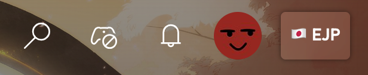
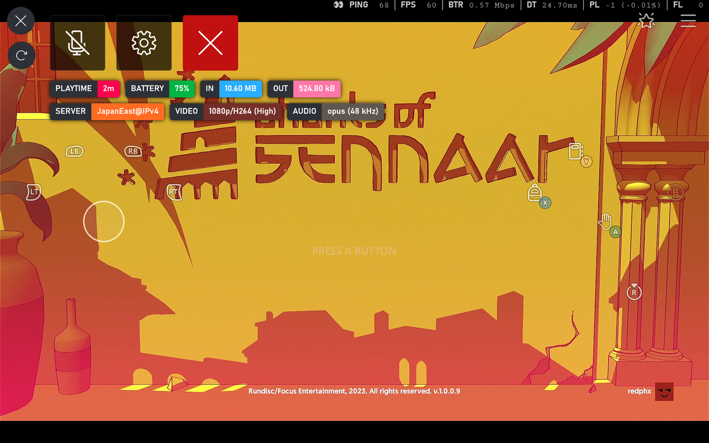

# How to install Better xCloud app for Android

 
 
  

!!! note  
    - I only distribute Better xCloud on GitHub, DO NOT download it on other websites or from unknown sources.

This app is a web app with the Better xCloud userscript intergrated.  

Support most devices running Android:  

- Android phones/tablets  
- Android TVs  
- Amazon Fire TV Stick 4K/4K Max
- Meta Quest VR headsets  
- ...

### Features
- Require Android 8.0 or later
- Small size (< 10MB)
- Still free and open-source (soon)
- Ads-free and tracking-free
- Support all features of the userscript
- Better performance and battery life
- Support custom userscript

### Android app exclusive features
- 🔥 [Support native Mouse & Keyboard](native-mouse-and-keyboard.md)
- 🔥 [Support emulating controller with Mouse & Keyboard](mouse-and-keyboard.md)
- Better device vibration support
- Limits screen's refresh rate to 60Hz to save battery life

The Android app doesn't support installing extensions. If you need this feature, use [Edge Browser](android-browser.md) instead.

## How to install

!!! warning
    ⚠️ You're most likely to have problems with the stream if you're using a cheap phone or a cheap Android TV device. [Read more](faq.md#android-app).  
    In that case, use [Edge Browser](android-browser.md) instead.

1. Download the APK file and install  

    [:material-download: Download on GitHub](https://github.com/redphx/better-xcloud-android/releases/latest){ class="md-button md-button--primary" target="_blank" }

2. Sign in

3. Click on the new *< SERVER NAME >* button next to your profile picture to adjust the settings

    

4. Enjoy

5. Check the [**Troubleshooting**](#troubleshooting) section below if you have problem with the app

## Troubleshooting

1. The stream is stuttering, it's unplayable.  
> Follow [this guide](guide/android-webview-tweaks.md) to improve the performance.

## FAQ
[Read here](faq.md#android-app)

## Screenshots

  
  
  
  
  
  
