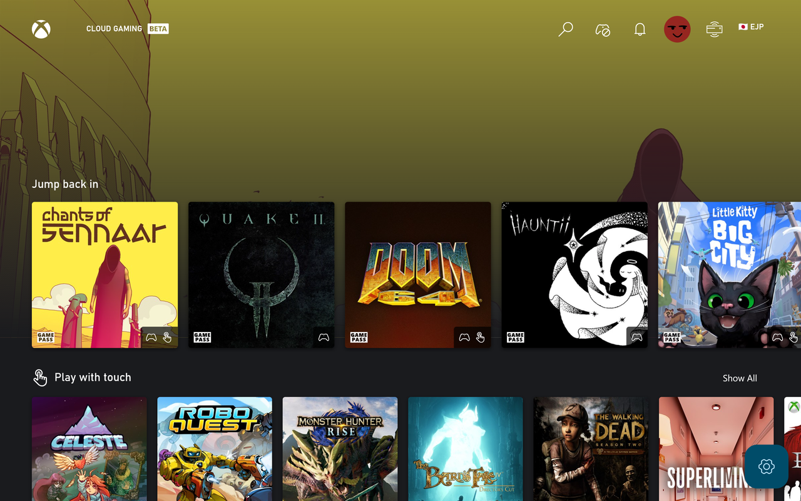

# Install Better xCloud app for Android

!!! note  
    - This app is still in **early development**
    - Use this method for Android/Android TV/Meta Quest VR headsets.
    - I only distribute Better xCloud on GitHub, DO NOT download it on other websites or from unknown sources.

This app is a web app with the Better xCloud userscript intergrated.  

- Small size (< 10MB)
- Support all features of the userscript
- Better performance and battery life
- Support custom userscript

### Android app exclusive features:
- Better device vibration support
- Automatically limits screen's refresh rate to 60Hz
- Better Android TV support (soon)

The Android app doesn't support installing extensions. If you need this feature continue then using Kiwi Browser.

# How to install

1. Download the APK file and install
    
    [:material-download: Download on GitHub](https://github.com/redphx/better-xcloud-android/releases/latest){ class="md-button md-button--primary" target="_blank" }

2. The app will download and install the userscript on first run

3. Sign in

4. Click on the new *< SERVER NAME >* button next to your profile picture to adjust the settings

    

5. Enjoy

6. [Report issue](https://github.com/redphx/better-xcloud-android/issues) if you found any

# Screenshots

  
  
  
  
