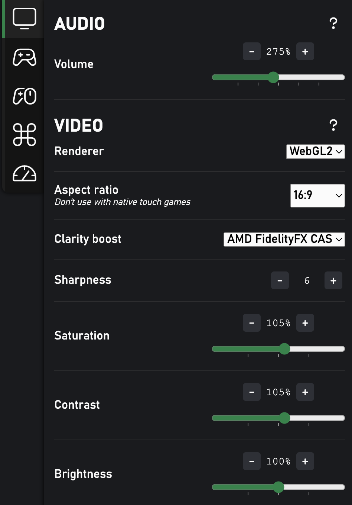
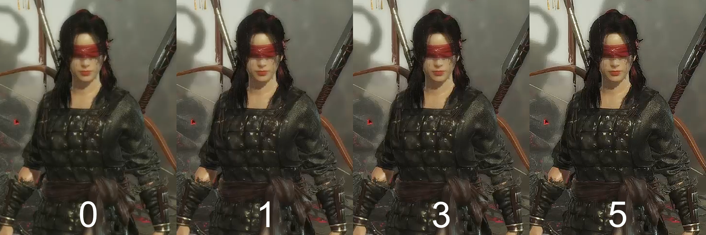

This feature improves the visual quality of the stream to make it look clearer and sharper. Unlike [Edge's exclusive Clarity Boost feature](https://www.microsoft.com/en-us/edge/features/clarity-boost), this works with all kind of devices and browsers.

### How to use

{ width="400" }

!!! important
    Disable Edge's Clariy Boost feature first if you're using it.

1. Open Better xCloud's Stream settings.
2. Switch to Audio & Video tab.
3. Adjust settings.

### Explain
- Renderer: there are two options
    - Default
    - WebGL2: better performance + battery life

- Clarity boost:
    - Unsharp masking: simple and provides acceptable visual quality.
    - AMD FidelityFX CAS: only available in WebGL2 renderer. This provides better visual quality than the Unsharp masking method.

### Which renderer to use?

If your device supports it, using WebGL2 + AMD FidelityFX CAS will provide the best visual quality + better battery life (~30%).

