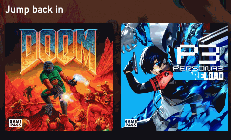

!!! note
    Settings in this page only go into effect on the next page load

Check [Stream settings](ingame-features.md) for settings that can be changed while playing.

## General

#### Language

  - Set the language of Better xCloud

#### Bypass region restriction

??? warning
    Use this at your own risk! It has the same risk as using VPN.

  - Allow playing Xbox Cloud Gaming in unsupported regions without having to use VPN

#### Controller-friendly UI

  - Make it easier to interact with the UI using only controller, keyboard or remote control

#### Enable the "Remote Play" feature
  - Allow using Remote Play on the website
  - [Learn more](remote-play.md)

---
## Server

#### Region
  - Allow connecting to another server instead of the default one
  - It's not using VPN

#### Preferred game's language
  - Allow setting the default language of the game
  - If the game doesn't support this language, it will use the language set by the server

#### Prefer IPv6 server
  - Might reduce latency

---
## Stream

#### Target resolution
  - Set the resolution of the stream

#### Change visual quality
  - Increase/decrease the quality of the stream to your liking

#### Maximum video bitrate
??? note
    Don't use this feature unless you want to limit the bitrate  

  - Set the preferred maximum bitrate of the video stream
  - It's normal (not a bug) if the real bitrate is sometime higher than this value.

#### Enable volume control feature
  - Allow boosting the stream's volume up to 600%  

#### Disable post-stream feedback dialog
  - *Self explanatory*

#### Apply video filters to screenshot
  - Screenshots will be captured with filters applied (brightness/contrast/...)

#### Enable microphone on game launch
  - Automatically enable the mic when starting to play a game.  

#### 🎮 Fortnite: force console version
  - Allow playing the `Save the World` mode on mobile

---
## Game Bar

#### Position
  - Position of the Game Bar on the screen

---
## Local co-op

#### Enable local co-op support
  - Allow playing some co-op games locally
  - [Learn more](local-co-op.md)

<!--
---
## Controller

### Enable controller shortcuts  
  - `Home` is  the button which activates the Xbox sidebar menu (similar to the Xbox/Nexus button on the official controller).  
  - Not all controllers have this button. It's the `B16` button on the [Gamepad Tester site](https://hardwaretester.com/gamepad).  
  - More shortcuts will be added later.
  
  | Shortcut      | Action           |
  |---------------|------------------|
  | Home + RB     | Take screenshot  |
  | Home + Select | Toggle stats bar |
-->

---
## Mouse & Keyboard

#### Native Mouse & Keyboard
  - This feature is only available on Chrome/Edge/Chromium browsers on desktop and [Better xCloud Android app](android.md)

### Emulate controller with Mouse & Keyboard  
  - Allow playing xCloud games with Mouse & Keyboard
  - [Learn more](mouse-and-keyboard.md)

### Hide cursor on idle
Hide the mouse cursor after 3 seconds of not moving.

---
## Touch controller

#### Availability
  - Only for devices with touch support (Android/iOS/iPadOS/...).  
  - Using `Desktop mode` in mobile browsers also disables this feature.  

    - **Default**: nothing change.  
    - **All games**: enable touch controller support for all games. Games with custom layout won't be affected.  
    - **Off**: stop the touch controller from showing when touching the screen. Useful when you play on a device with a built-in controller like Logitech G Cloud, Steam Deck, etc.  

#### Button styles
  { width="400" }

  - Default  
  - Muted  
  - All white (only for standard/default controller)  

#### [Custom touch controller layouts](https://github.com/redphx/better-xcloud/discussions/241) for non-touch supported games

---
## Loading screen

#### Show game art
  - Replace the black background with game art if it's available.  

#### Show the estimated wait time
  - The time is estimated by the server
  - It's not 100% correct: you might get in the game sooner or later

#### Rocket animation
  - Always show/Hide when queuing/Always hide. 
  - Hide this animation might save some battery life while queuing  

---
## UI

#### Layout
  - Switch between default layout and Smart TV layout (without having to change `User-Agent`).  

#### Show wait time in game card
  - Show the current wait time of the game after 1 second

#### Show controller connection status
  - Show/hide the toast message when a controller is connected/disconnected

#### Simplify Stream's menu
  - Hide the labels of the menu buttons.  

#### Skip Xbox splash video
  - Save 3 seconds.

#### Hide System menu's icon  
  - System menu is the menu bar with the dots icon as a handle when playing
  - You can still click on it, but it doesn't block the screen anymore

#### Reduce UI animations
  - Disable `transition` CSS property in some elements.

#### Disable social features
  - Features like friends, chat...
  - Disable these will make the page load faster

#### Hide sections
  - Allow removing some sections on the home screen

---
## Other  

#### Disable xCloud analytics
  - The analytics contains statistics of your streaming session, so I'd recommend allowing analytics to help Xbox improve xCloud's experience in the future.

---
## Advanced features  

#### User-Agent
??? warning
    99% of the time you don't need to use this feature anymore. Don't use it unless you're absolutely have to.

  - Useful when you're using unsupported browsers.
  - This setting only affects xCloud, and it doesn't change browser's global User-Agent.
