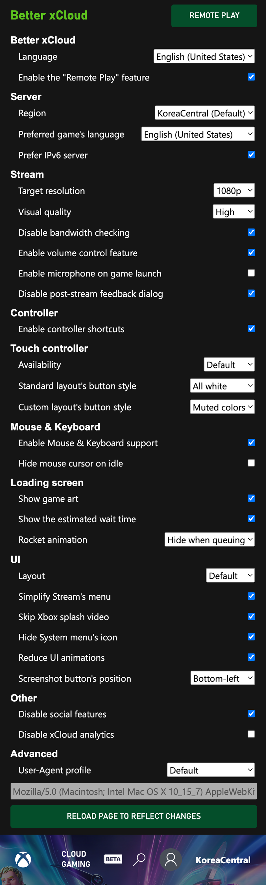
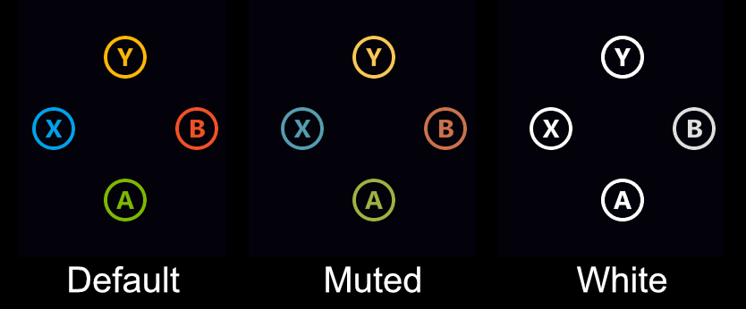
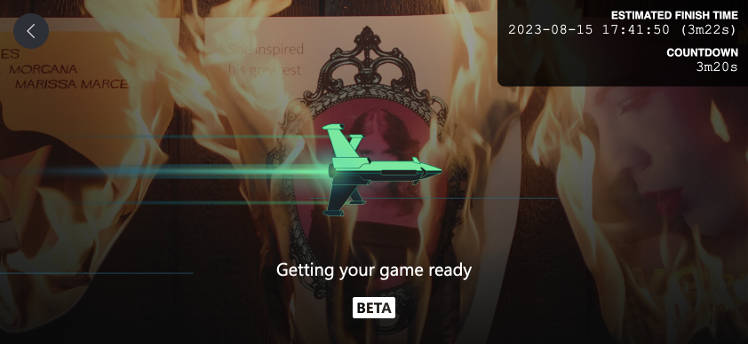

{ width="600" }

## Server

### Set the region of streaming server
  - Connect to another server instead of the default one.  
  - It's not using VPN.  
  - ["Will I get banned for using this?"](faq.md)  

### Preferred game's language
  - If the game doesn't support this language, it will use the same language as xCloud's website.  

### Prefer IPv6 server
  - Might reduce latency.

---
## Stream

### Set target resolution
  - By default you only get 1080p stream when playing on desktop. This feature can give you 1080p stream even on mobile, without having to change `User-Agent` value.  

### Change visual quality
  - Increase/decrease the quality of the stream to your liking. Only works in Chrome/Edge/Kiwi...  
  - Comparison video with the setting ON & OFF: https://youtu.be/-9PuBJJSgR4  
  - By default (for compatibility reasons) xCloud only uses high quality codec profile when you use Tizen TV or Chrome/Edge/Chromium browser on Chrome/MacOS. Enable this setting will give you the best experience no matter what platform & browser you're on.

### Enable volume control feature
!!! warning
    Disable this setting if you experience slowdown, choppy/muted stream  

  - Allow increasing stream's volume up to 600%  

### Enable microphone on game launch
  - Automatically enable the mic when starting to play a game.  

### Hide mouse cursor on idle
  - Hide the mouse cursor after 3 seconds of not moving.  

---
## Controller

### Enable controller shortcuts  
  - `Home` is  the button which activates the Xbox sidebar menu (similar to the Xbox/Nexus button on the official controller).  
  - Not all controllers have this button. It's the `B16` button on the [Gamepad Tester site](https://hardwaretester.com/gamepad).  
  - More shortcuts will be added later.
  
  | Shortcut      | Action           |
  |---------------|------------------|
  | Home + RB     | Take screenshot  |
  | Home + Select | Toggle stats bar |

---
## Touch controller

### Availability
  - Only for devices with touch support (Android/iOS/iPadOS/...). Using "Desktop mode" in mobile browsers also disables this feature.  
    - **Default**: nothing change.  
    - **Off**: stop the touch controller from showing when touching the screen. Useful when you play on a device with a built-in controller like Logitech G Cloud, Steam Deck, etc.  
    - **All games**: enable touch controller support for all games. Games with custom layout won't be affected.  
  - Double-tap anywhere at the bottom of the screen to show/hide the controller. Useful when you're viewing cutscenes.  

  

### Button styles
  { width="400" }

  - Default  
  - Muted  
  - All white (only for standard/default controller)  

### [Custom touch controller layouts](https://github.com/redphx/better-xcloud/discussions/241) for non-touch supported games

---
## Mouse & Keyboard

### Enable Mouse & Keyboard support
Allow you to play xCloud games with Mouse & Keyboard. Check [this page](mouse-and-keyboard.md) for more info.

### Hide cursor on idle
Hide the mouse cursor after 3 seconds of not moving.

---
## Loading screen

### Show game art
  - Replace the black background with game art if it's available.  

### Show the estimated wait time
  - The time is estimated by the server.  
  - It's not 100% correct: you might get in the game sooner or later.  
  - Check [#51](https://github.com/redphx/better-xcloud/issues/51) for more info.  

### Show/hide the rocket animation
  - Always show/Hide when queuing/Always hide.  
  - Hide this animation might save some battery life while queuing.  

---
## UI

### Switch website's layout
  - Switch between default layout and Smart TV layout (without having to change `User-Agent`).  

### Simplify Stream's menu
  - Hide the labels of the menu buttons.  

### Skip Xbox splash video
  - Save 3 seconds.

### Hide System menu's icon
  - You can still click on it, but it doesn't block the screen anymore.

### Reduce UI animations
  - Disable `transition` CSS property in some elements.

---
## Other  

### Disable social features
  - Features like friends, chat... Disable these will make the page load faster.  

### Disable xCloud analytics
  - The analytics contains statistics of your streaming session, so I'd recommend allowing analytics to help Xbox improve xCloud's experience in the future.

### Hide footer and other UI elements (always on)

---
## Advanced features  

### Change User-Agent
!!! warning
    99% of the time you don't need to use this feature anymore.

  - Useful when you're using unsupported browsers.  
  - This setting only affects xCloud, and it doesn't change browser's global User-Agent.  
  - 📝 If you get 404 error after using this feature, try refreshing the page a few times. See [#34](https://github.com/redphx/better-xcloud/issues/34).  
