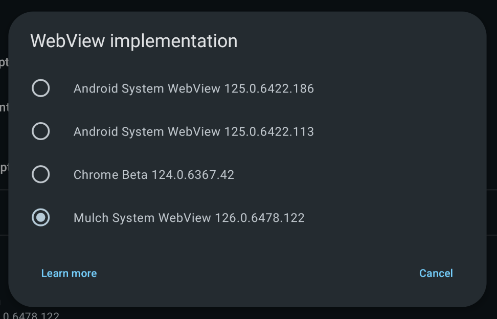

# How to switch Android WebView implementation

!!! note
    - This change only applies to the Better xCloud app. Your device still uses the default WebView implementation.
    - Not all browsers can be selectable. If you don't see it in the list, it means that browser/version isn't supported.
    - If Better xCloud app crashes after changing the WebView implementation, maybe you installed 64-bit version on a 32-bit device. Uninstall the 64-bit version and re-install the 32-bit one.

Make sure you're using the latest version of Better xCloud app.

1. Install the WebView provider you want to use:
    - Android System WebView: [APKMirror](https://www.apkmirror.com/apk/google-inc/android-system-webview/)  
    <!-- - Chrome: [APKMirror](https://www.apkmirror.com/apk/google-inc/chrome/chrome-123-0-6312-81-release/) (you must install this version, the version on Play Store doesn't work) -->
    
    - Thorium: [info](https://github.com/Alex313031/Thorium)
        - [64-bit device](https://github.com/Alex313031/Thorium-Android/releases/download/M124.0.6367.218/SystemWebView_arm64.apk)  
        - [32-bit device](https://github.com/Alex313031/Thorium-Android/releases/download/M124.0.6367.218/SystemWebView_arm32.apk)  
        > Shown as `Android System WebView...`. You can't install this WebView if you already have a `com.android.webview` app on your device.

    - DivestOS Mulch WebView: [info](https://divestos.org/pages/our_apps#mull)
        - [64-bit device](https://gitlab.com/divested-mobile/mulch/-/raw/master/prebuilt/arm64/webview.apk)
        - [32-bit device](https://gitlab.com/divested-mobile/mulch/-/raw/master/prebuilt/arm/webview.apk)
    

2. Open Better xCloud Android app > `Settings` > `WebView implementation` > pick the new WebView.
3. ⚠️ Close the app completly (force close) and re-open it.
4. If the app crashes on startup, open it again for a few more times and it will open the Settings so you can change the WebView. If this doesn't happen, clear Better xCloud app's settings and try again.  
5. You may need to do [additional steps](./android-webview-tweaks.md) to improve the performance.

# Found bugs/issues?
Report bugs in [issue #55](https://github.com/redphx/better-xcloud-android/issues/55) (along with [Logcat](https://www.xda-developers.com/how-to-take-logs-android/)).
