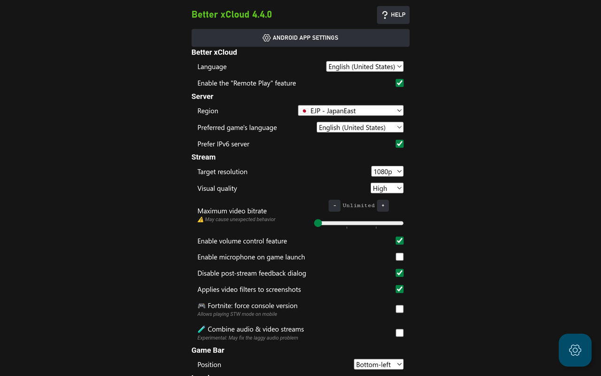

# Better xCloud
 
 
  

Improve Xbox Cloud Gaming (xCloud) experience on [xbox.com/play](https://www.xbox.com/play).  
It also allows you to use Remote Play on the xCloud website.

-   :material-monitor: Windows, macOS, Linux, SteamOS (Steam Deck)  

    ---

    [:material-google-chrome: Install on Chrome/Edge](chromium.md){ .md-button .md-button--primary }

-   :material-android: Android, Android TV, Meta Quest VR headsets  

    ---

    [:material-android: Install Android app (Beta)](android.md){ .md-button .md-button--primary }  

    or [install on Edge Browser](android-browser.md)

-   :material-apple: macOS, iOS, iPadOS  

    ---
    
    [:material-apple-safari: Install on Safari](safari.md){ .md-button .md-button--primary }

-   :material-television: LG TV  

    ---
    
    [:material-web: Install on webOS 22+](lg-webos.md){ .md-button .md-button--primary }

[How to pick the best client for your device](clients.md)

### Third-party apps
- [Nexus+](https://apps.apple.com/us/app/nexus/id6475538023) for Apple Vision Pro ([guide](https://gist.github.com/KhaosT/a4d90479e3cb0aae959ad55b08cd8358){ target="_blank" }, created by another dev [KhaosT](https://github.com/KhaosT){ target="_blank" })  

### Will I get banned for using this?
No, it's safe to use. xCloud devs endorsed **Better xCloud** before and confirmed they ["don't ban people for using a third party client or extension"](https://old.reddit.com/r/xcloud/comments/1b5d4dl/new_better_xcloud_feature_play_local_coop_games/kt6w1wt/). As always, use it as your own risk.

### Key features

-   :material-open-source-initiative: Free and open-source

    ---

    Totally free and open-source.  
    Also ads-free and tracking-free (except trackers from the xCloud website, but you can disable those).

-   :material-shield: Safe to use

    ---

    Never send your Xbox account or token to another website.

-   :material-microsoft-xbox: Remote Play support

    ---

    Desipte its name, **Better xCloud** supports using Remote Play on **xbox.com/play** website at 1080p. You can even stream Xbox 360 games.

    [:material-chevron-right: How to enable](remote-play.md)

-   :material-quality-high: High visual quality

    ---

    Enable 1080p resolution & high-quality codec profile on all devices (if supported).

-   :fontawesome-solid-wand-magic-sparkles: Clarity boost

    ---

    Use multiple methods to improve the visual quality of the stream to make it look clearer and sharper.

    [:material-chevron-right: How to use](clarity-boost.md)

-   :material-human-queue: Local co-op support

    ---

    Allow playing some xCloud games locally.

    [:material-chevron-right: How to enable](local-co-op.md)

-   :material-keyboard: Mouse & Keyboard support

    ---

    Allow playing with mouse & keyboard, either natively or virtually on desktop browsers and in Android app.

    [:material-chevron-right: Native Mouse & Keyboard](native-mouse-and-keyboard.md)

    [:material-chevron-right: Virtual controller](mouse-and-keyboard.md)

-   :material-gesture-tap: Touch controller

    ---

    Allow playing with touch controls in all games

    [:material-chevron-right: How to enable](features.md#touch-controller)

-   :material-gesture-tap: Custom touch controllers

    ---

    Custom touch controller layouts for non-touch supported games

    [:material-chevron-right: Supported games](https://github.com/redphx/better-xcloud/discussions/241)

-   :material-camera: Taking stream's screenshot

    ---

    Take screenshots of the stream with a single click.

    [:material-chevron-right: How to use](screenshot-capture.md)

[And many more...](features.md)

### Screenshots (Android app)

  
  
  
  
  
  

### Disclaimers  
- Use it at your own risk.
- This project is not affiliated with Xbox in any way. All Xbox logos/icons/trademarks are copyright of their respective owners.
