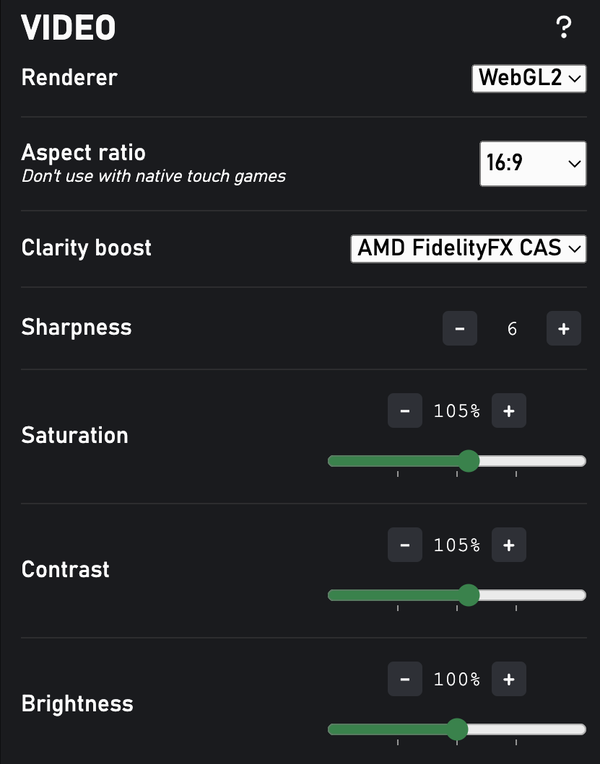

## Stream menu

### Display stream's statuses:  
- Region/Server/Codec/Resolution...  
- Current playtime of the session.  
- Current battery level. Not working on [some browsers](https://caniuse.com/battery-status).  
- Estimated total data sent/received.  

### Restart the stream
Hold the `Quit Game` button for a few seconds to restart the stream. Useful when you're playing fullscreen and don't have access to the reload button.

---
## Mouse and Keyboard
Check [Mouse and Keyboard page](mouse-and-keyboard.md) for more details.

---
## Controller
{ width="400" }

### Controller & device vibrations
  - Control vibration settings.  
  - Adjust vibration intensity.  

---
## Audio

{ width="400" }

### Volume control
- Increase stream's volume up to 600%.  
- Disable this setting if you have problems with the audio.  

---
## Video
{ width="400" }

### Improve stream's clarity

*(click to enlarge)*

- Similar to the "Clarity Boost" of xCloud on Edge browser. [Demo video](https://youtu.be/ZhW2choAHUs).  
- Affects the stream's performance, uses more battery, and may causes frames to drop (especially on lower-end devices).  
- Only works with Chrome/Chromium browsers.  

### Change video's ratio
Useful when you don't have a 16:9 screen

### Adjust video filters
- Brightness/Contrast/Saturation.  
- ⚠️ These features don't work when xCloud's "Clarity Boost" feature is ON ([#64](https://github.com/redphx/better-xcloud/issues/64)).  
