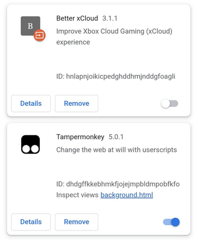
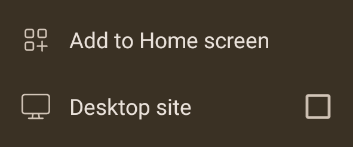

# Install Better xCloud on Kiwi Browser

!!! tip
    - The [Android app](android.md) is available for testing. It's recommended over using Kiwi Browser.

!!! note
    - Use this method for Android/Android TV/Meta Quest VR headsets.
    - I only distribute **Better xCloud** on GitHub, *DO NOT* download it on other websites or from unknown sources.

1. Install **Kiwi Browser**
    
    [:material-google-play: Install on Play Store](https://play.google.com/store/apps/details?id=com.kiwibrowser.browser){ class="md-button md-button--primary" target="_blank" }

    or

    [:material-google-play: Sideload on APKMirror](https://www.apkmirror.com/apk/geometry-ou/kiwi-browser-fast-quiet/){ class="md-button md-button--primary" target="_blank" }

2. Install the **Tampermonkey extension**  

    [:material-puzzle: Install **Tampermonkey**](https://chromewebstore.google.com/detail/tampermonkey/dhdgffkkebhmkfjojejmpbldmpobfkfo){ class="md-button md-button--primary" target="_blank" }

3. Install **Better xCloud** script  

    [:material-download: Install **Better xCloud**](https://github.com/redphx/better-xcloud/releases/latest/download/better-xcloud.user.js){ class="md-button md-button--primary" target="_blank" }

    !!! warning
        You must install **Better xCloud** as a script inside the **Tampermonkey extension**, or it won't work!

4. Visit [https://www.xbox.com/play/](https://www.xbox.com/play/)

5. Click on the new *< SERVER NAME >* button next to your profile picture to adjust the settings

    

# Troubleshooting

If **Better xCloud** doesn't work or you see a `???` button, that means you installed it incorrectly.  

You must install **Better xCloud** as a script inside the **Tampermonkey extension**, not as an extension. If you see something like this in the Extensions page, uninstall the **Better xCloud** extension and try again.

# Tips

In **Kiwi Browser**'s menu:

- Disable the "Desktop site" setting.
- Use the "Add to Homescreen" feature to create a shortcut on the home screen that launchs xCloud as a full screen app.
