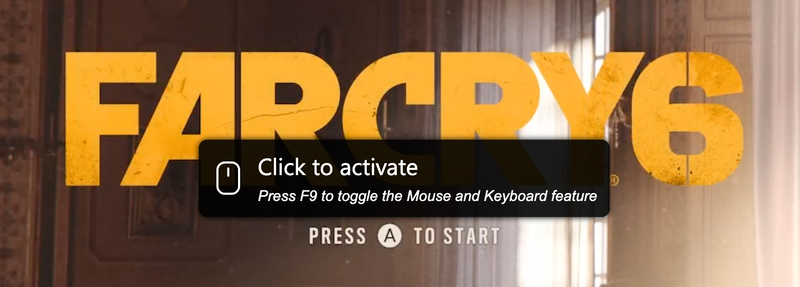
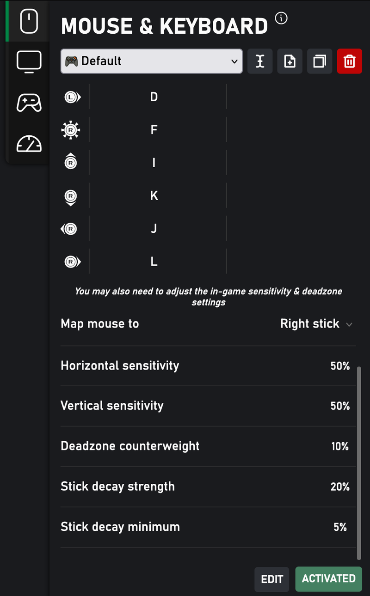

- 100% free.
- No input lag.
- Works with every games.
- Key remapper & adjustable mouse sensitivities.
- Multiple presets.

---
## How to use

- Enable this feature first in `Better xCloud's Settings > Mouse & Keyboard > Enable Mouse & Keyboard feature`.
- Play any game, then click on the message to lock your mouse and start emulating the controller.

    { width="600" }

- Press `Esc` to release the mouse cursor and stop emulating the controller.

- Press `F9` to toggle this feature (no more `Click to activate` popup).

---
## Remapper

- Open remapper in `... > Stream setting > Mouse & Keyboard tab`

    { width="400" }

### Presets
- Allow creating multiple presets for different games.

### Keys
- Reserved keys:
    - `F9`
    - `Esc`
- Right-click on a key to unbind it.
- Supported mouse buttons:
    - Left/Right/Middle-click
    - Scroll up/down/left/right

### Mouse
- ⚠️ You may also need to adjust the in-game sensitivity & deadzone settings.

- You can choose which analog stick the mouse is mapped to.
- Deadzone counterweight
  > Counteracts the game's built-in deadzone
- Stick decay strength/minimum
  > Decides how fast the analog stick's value will return to the center when the mouse is stopped moving (to simulate the effect of releasing the analog stick on the real controller)
