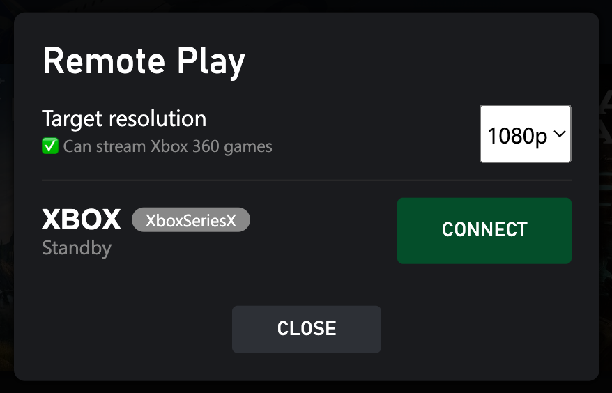

{ width="400" }

## Features
- Allow you to use Remote Play in the browser.
- Support streaming Xbox 360 games with 1080p resolution.
- Can play even when you're not using home network.

## Set up Remote Play on Xbox

1. Follow this [official guide](https://support.xbox.com/en-US/help/games-apps/game-setup-and-play/how-to-set-up-remote-play) to enable the Remote Play feature on your Xbox.  

2. Setup [port-forwarding](https://support.xbox.com/en-US/help/hardware-network/connect-network/network-ports-used-xbox-live) on your network.  

3. Open port `9002` if you want to use Remote Play when not using the home network.
  If it doesn't work, try to open port `4838` and `5050`, especially when you're streaming from an Xbox One.

## Enable the Remote Play feature in Better xCloud
1. Open Better xCloud's settings.
2. Check the "Enable Remote Play feature" checkbox.
3. Reload the page.
4. Now you'll see the "Remote Play" button next to your profile picture.
