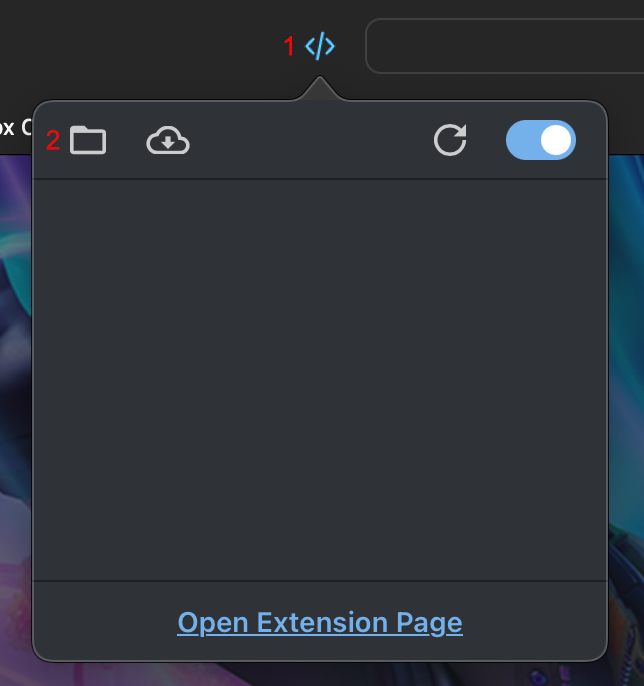

# Install Better xCloud on Safari macOS/iOS/iPadOS

!!! note
    - Use this method for iOS/iPadOS.
    - On macOS, it's recommended to use **Better xCloud** with [Chrome/Edge browser](chromium.md) instead of Safari.
    - I only distribute **Better xCloud** on GitHub, *DO NOT* download it on other websites or from unknown sources.

**Better xCloud** allows you to bypass PWA requirements on iOS/iPadOS (including version 17.4).

## Main problem

**Better xCloud** supports macOS, iOS, and iPadOS with Safari.

To use it with Safari, you have to install the [Userscripts extension](https://apps.apple.com/us/app/userscripts/id1463298887) (free & open-source).  
But this extension has [one big issue](https://github.com/redphx/better-xcloud/issues/81): it doesn't always work as intended (due to the limitation of Safari).

To work around this problem, I've implemented a feature that **Better xCloud** will automatically refresh the page until it works. If you see a message like this screenshot below, just wait for the page to reload. It usually takes 1-2 times maximum.  

That's why, on macOS, I *recommend* using Chrome/Edge browser + Tampermonkey extension for the best experience + stream quality (you won't be able to use the high-quality codec in Safari).

---
## Other limitations
- Extension only works in the browser. It's not available in PWA mode (the shortcut you created using "Add to Home Screen" prompt). Installing **Better xCloud** successfully will disable this prompt, allowing you to use it in the browser.    
- Fullscreen mode is not available in the browser. You can only minimize the address bar.  
- It doesn't support Mainline codec profile, which provides a higher quality stream than the default one (Baseline profile).  
- Battery badge doesn't work.

If you want to have the best xCloud experience, play it on Android phone/tablet if possible.  

---
## Install on iOS/iPadOS

*Thanks [GopherTheCoder](https://github.com/GopherTheCoder) for the guide*

1. Download the **Better xCloud** script to your device.  
    
    [:material-download: Download **Better xCloud**](https://github.com/redphx/better-xcloud/releases/latest/download/better-xcloud.user.js){ class="md-button md-button--primary" target="_blank" }

2. Open the `Downloads` folder in the **Files** app, create a new `userscripts` folder and move the `better-xcloud.user.js` file into that folder.

3. Install the **Userscripts** extension from App Store.  
    
    [:material-puzzle: Install **Userscripts**](https://apps.apple.com/us/app/userscripts/id1463298887){ class="md-button md-button--primary" target="_blank" }

4. Open `Device's Settings > Safari > Extensions`, then enable the Userscripts extension.

    

5. Open the newly installed **Userscripts** app found in home screen, then click on **Set Userscripts Directory**.

    

6. Select the `Downloads/userscripts` folder that you created in step #2.

7. Open Safari and visit [https://www.xbox.com/play](https://www.xbox.com/play).

8. Click on the Extension button in the address bar, click on the "Userscripts" button, then choose "Always Allows..." and "Always Allow on This Website" options.

    

9. If you set everything up correctly, you'll see a new button next to your profile picture.

    

---
## Install on MacOS

!!! warning
    For the best experience, use Chrome/Edge browser instead of Safari if possible.

1. Install the **Userscripts** extension from App Store.  
    
    [:material-puzzle: Install **Userscripts**](https://apps.apple.com/us/app/userscripts/id1463298887){ class="md-button md-button--primary" target="_blank" }

2. Open Safari, click on the "Userscripts" button, then "Open save location".

    

3. Download and save the **Better xCloud** script into the folder in step #2.  
   
    [:material-download: Download **Better xCloud**](https://github.com/redphx/better-xcloud/releases/latest/download/better-xcloud.user.js){ class="md-button md-button--primary" target="_blank" }

4. Visit [https://www.xbox.com/play](https://www.xbox.com/play).

5. Make sure you see the "Better xCloud" script in the "Userscripts" popup.
    

5. If you set everything up correctly, you'll see a new button next to your profile picture.

    
