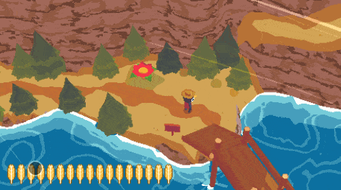

- This feature is only available in **Better xCloud**.  
- Works on both desktop & mobile, but it was designed for mobile users.
- It's client-side only.
- It captures the current frame of the stream and saves it to a file. That means you won't get the raw quality like when you play on a console, but it's still better than using the built-in screenshot feature on your phone.  
- Screenshot's resolution & quality depend on the quality of the stream at the moment.  
- Screenshot doesn't include touch UI, notification bar... only the gameplay.  
- There might be a slight delay.  
- ⚠️ It's not possible to map the Share/Screenshot button on your controller to this feature.  

### How to
1. Enable this feature in the Settings.
2. Play a game.
3. Tap once at the bottom left/right (depending on your setting) to show the Screenshot button.
4. Tap on that button to capture screenshot.
5. Screenshot will be saved by the browser.
6. You can double-tap that corner to capture screenshot.

