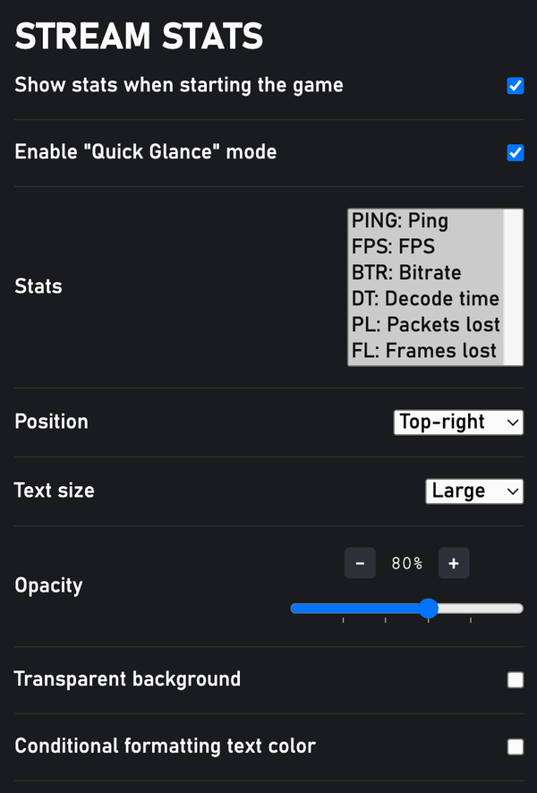

{ width="418" }

!!! note
    Showing the stats bar may affect the performance of the stream & inscrease the battery usage.
  
- While playing > `...` > `Stream Stats`.  
- Change settings by opening `Stream settings` while playing.  
- This bar is updated every second.  
- **Quick glance** feature: only show the stats bar when the System menu is expanded. The 👀 emoji at the beginning indicates that the stats bar is in the quick glance mode.  

| Abbr. | Full name          | Explain                                                                                                                                           |
|------:|:-------------------|:--------------------------------------------------------------------------------------------------------------------------------------------------|
| PING  | Ping               | The number of seconds it takes for data to be sent from your device to the server and back over (the correct term is "Round Trip Time")           |
| FPS   | Frames per Seconds | The number of decoded frames in the last second of the stream (may not be the same as the FPS of the game)                                        |
| DT    | Decode Time        | The average time it took to decode one frame in the last second (bugged on Android [#26](https://github.com/redphx/better-xcloud/issues/26))      |
| BR    | Bitrate            | The amount of data the server sent to your device in the last second                                                                              |
| PL    | Packets Lost       | The total number of packets lost                                                                                                                  |
| FL    | Frames Lost        | The total number of frames dropped prior to decode or dropped because the frame missed its display deadline                                       |

This info is provided by WebRTC API. You can use browser's built-in tool to see more info:  

- Chrome/Edge/Chromium variants: `chrome://webrtc-internals`  
- Firefox: `about:webrtc`

**Colors:**  

- Red = Bad  
- Yellow = Okay  
- Green = Good  
- White = Great  
